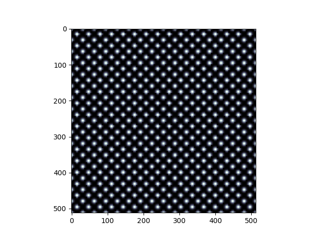
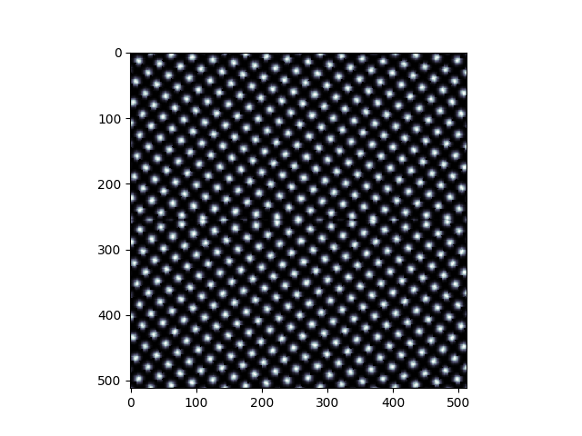

# Constructing Initial Fields

When running phase field crystal calculations, GOPF comes with a set of useful functions for
constructing initial fields.

* **BuildCrystal** can construct any crystal structure by passing the unit cell and the basis.
An example for a simple cubic lattice with basis *(0, 0), (0.5, 0.5)* is shown below

* **TiltGB** constructs a tilt grain boundary at an arbitrary angle using an existing single crystal field

