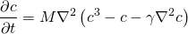

# Cahn-Hilliard Equation

Here, we show how the Cahn-Hilliard equation can be solved using GOPF.

    

*M* is a mobility factor, gamma is a the gradient coefficient which is related to the surface tension and control the width of the diffuse interface.
We start the calculation by initializing the concentration field at random. Four snapshots of the concentration field at different times is shown below

 
 

 
 

We observe that a spinodal decomposition takes place, and gradually larger domains form.
