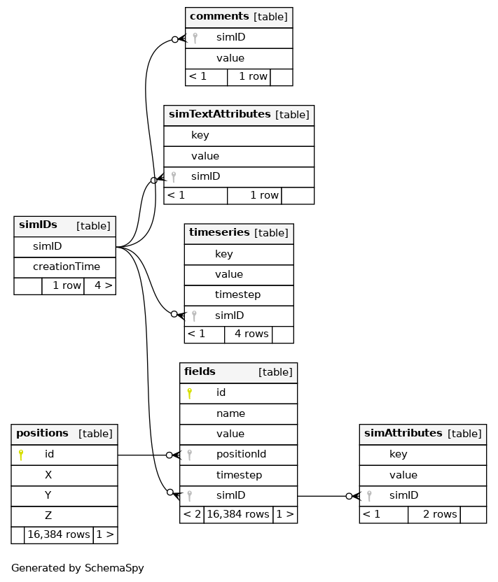
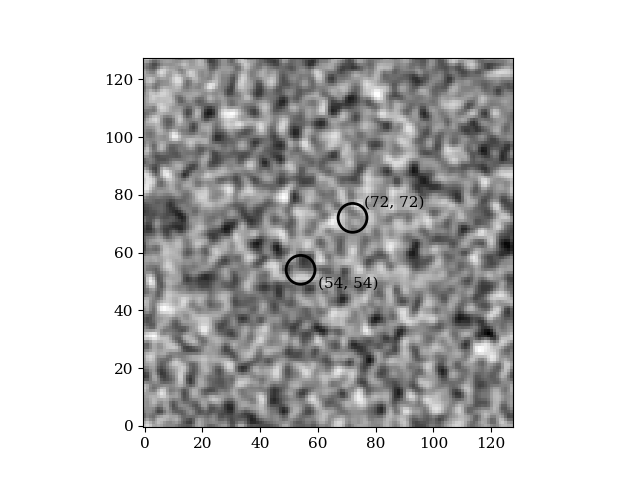
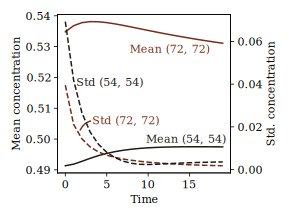

# Using Databases

GOPF can use SQLite databases to keep track of multiple simulations. The main benefit
is that there is only one file containing all the results of a series of simulations.
There is also a command line interface (CLI) to show/list the content of the database.

```bash
gopf db -h
```

will display a help message for the commands related to the database. The database is organized
as shown belo.



All entries written by one simulation is labeled with an *simulation ID*.

## CLI Tool

* `gopf db -h` shows all available DB commands
* `gopf db attr` Command for listing simulation attributes
* `gopf db comment` Show or update a comment of a given simulation ID
* `gopf db export` Export data to csv files
* `gopf db list` Lists content of the database
* `gopf db time` Prints the creation time of a simulation ID

Add *-h* to any of the commands above for a longer explination.

## Example
In this example we study the diffusion equation. The purpose of the example is to
show how the database can be used to store information about the simulation.
The equation we want to solve is


Furthermore, we are interested in the spatial average and the spatial standard
deviation within two circular regions of interest. The locaitons are (54, 54)
and (72, 72) and the radius is 5. Thus, we set up monitors to track the field
evolution in these two regions see *main.go*. The spatial averages and the
standard deviations are stored as a timeseries in the database.

First we run the main program

```bash
go run main.go
```

a database called *diffusion.db* should appear. Now we inspect the IDs in the database

```bash
gopf db list -c simid diffusion.db

-----------------------------------------------------------
| Sim Id                  | Creation time                 |
-----------------------------------------------------------
| 1494972749              | 2020-06-04 11:57:56           |
-----------------------------------------------------------
```
Note that the creation time and the simulation ID will be different in your case.
We now use the DB CLI to extract our timeseries in a comma separated file such that
it easily can be accessed by a plotting program.

```bash
gopf db export -t timeseries -i 1494972749 -o timeseries.csv diffusion.db

Timeseries written to timeseries.csv
```

The first few rows of the generated csv is

```txt
monitor7272_std,monitor5454_mean,monitor5454_std,monitor7272_mean
0.039544,0.491342,0.069248,0.534785
0.021193,0.491862,0.041915,0.536769
0.014421,0.492770,0.026692,0.537764
```

Similarly, we export can export the concentration field by

```bash
gopf db export -t fd --timestep 0 -i 1494972749 -o conc.csv diffusion.db
```

The first few rows in the generated csv file is

```txt
X,Y,Z,conc
0,0,0,0.592334
0,1,0,0.621943
0,2,0,0.590564
```

We can now plot the data using the `plots.py` script.




The places where we tracked the the spatial average and standard deviations of the concentration
fields are highlighted with a circle.