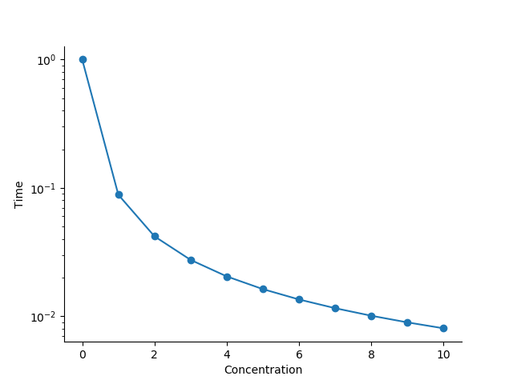

# Diffusion Equation
This examples shows how one can solve the problem

    

We begin with a only one pixel equal to 1 at the center of the image. Further, a monitor is added to track the concentration at the center.

    
    

