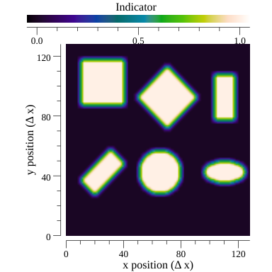

# Drawing Basic Geometrical Shapes

GOPF has basic support for drawing geometrical shapes. Implemented shapes

* Box (square in 2D and cube in 3D)
* Ball (circle in 2D and sphere in 3D)

In addition to the shapes, there are also several affine transformations that can be applied

* Translation
* Rotation
* Scaling

This makes it possible to make rectangles and ellipses.

Here, is a selection of shapes that can be drawn

