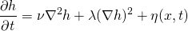
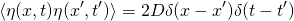

# Kardar-Parisi-Zhang Equation

The Kardar-Parisi-Zhang (KPZ) equation non-linear stochastic partial differential equation. It describes the
height field *h* with respect to the time *t* and spatial coordinates *x*. The equation is given by

where *&lambda;* and *&nu;* are tunable parameters. *&eta;* is a gaussian random noise term satisfying

Snapshots of a soluton a *128x128* grid are shown below

    
    

    
    

An animation of the solution can be found on [youtube](https://www.youtube.com/watch?v=DlZTG_lcu90&feature=youtu.be). 
The average width *W* defined by

where *A* is the total area, develops as shown below

Here, the dynamic exponent (*W(t) &prop; t&beta;*)is *&beta; = 0.235 &plusmn; 0.006* from powerlaw fits to 100 independent runs. Considering the
simpliclity of this setup (*128x128* grid), this is remarkably close to state-of-the-art estimates *&beta; = 0.2415 &plusmn; 0.0015* [1].

[1] [Kelling, Jeffrey, and Géza Ódor. "Extremely large-scale simulation of a Kardar-Parisi-Zhang model using graphics cards." Physical Review E 84.6 (2011): 061150.](https://doi.org/10.1103/PhysRevE.84.061150)