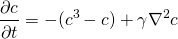

# Solver Stability
This examples shows the stability of different time-stepping schemes. As a test case we use
the Allan-Cahn equation

    

here we use &gamma; = 0.02. We run 100 steps and checks if the solution goes to NaN.

Scheme\Timestep | 0.1 | 1.0 | 1.5 | 1.9 | 2.0 |
| ------------- | :-: | :-: | :-: | :-: | :-: |
euler | x | x | - | - | - |
rk4   | x | x | x | x | - |

The RK4 scheme can be applied with almost two times larger time step. But it should be noted that
the computational cost on each scheme is higher than for the euler scheme.