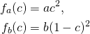
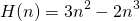
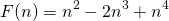
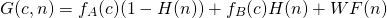
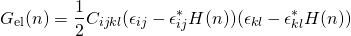
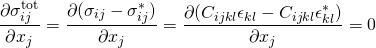
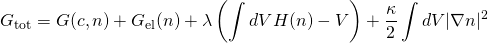
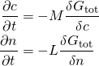

# Precipitate Deformation Due to Misfit Strains

In this example, we shod how GOPF can be used to study how precipitates behave when they are influenced by strain fields.
We consider a material with cubic symmetry and elastic constants C11 = 110.0, C12 = 60.0 and C44 = 30.0. The rest of 
constants are given by symmetry. Moreover, the precipitate has a misfit strain of 0.05 along one of the principal
axis and -0.01 along the other. Two fields are required to study this system. First, one that represents the 
concentration *c* and secondly one that represents the phase *n*. *n = 1*, means that the system is in phase B 
and *n=0* means the the system is in phase A. The free energy in phase A and B is given by

    

Further, we define an interpolating function

    

and a function that ensures that we only have physical minima (e.g. *n = 0* and *n=1*)

    

Finally, the chemical part of the free energy is expressed as

    

where *W* is a tunable parameter. The second part of the free energy comes from the elastic energy

    

The strains with a \* indicates misfit strains, and the unstarred strains are found by requiring mechanical equillibrium

    

Since we are primarily interested in the deformation of the precipitate, we need a term that ensures that the overall volume
of the precipitate is conserved. This is done by adding a Lagrange multiplier term to the equation. Thus, the full expression
for the free energy becomes

    

where lambda is updated on each time step such that the change in the volume average of *n* is zero. The phase field equations
are found by taking the functional derivatives of the total free energy

    

Parameter settings in the example:

| Quantity | Value |
| -------- | ----- |
| *a*      | 0.1   |
| *b*      | 0.1   |
| *W*      | 0.1   |
| *M*      | 1.0   |
| *L*      | 1.0   |
| kappa    | 0.1   |

Here, we started from a square precipitate, and due to the initial misfit strain it prefers to form an elongated domain

    
    

